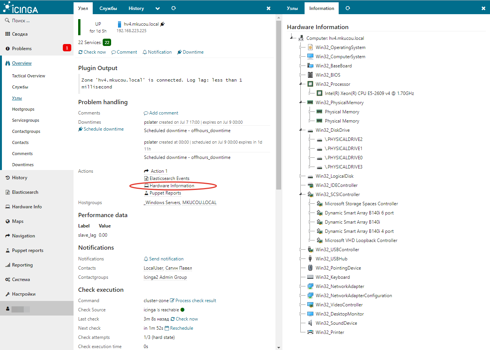

Icinga Web 2 - Hardware information module
======

[Description of the project, while in Russian.](http://webnote.satin-pl.com/2017/05/09/icingaweb2_module_hardwareinfo/)


#### About





#### License

Icinga Web 2 and this Icinga Web 2 module are licensed under the terms of the GNU General Public License Version 2, you will find a copy of this license in the LICENSE file included in the source package.


#### Requirements

  + Icinga Web 2 (>= 2.4.1)
  + MySQL (>=5.5)

#### Instalation

Create a MySQL database using the script: ```sql/inventory.sql```

Extract this module to your Icinga Web 2 modules directory as hardwareinfo directory.

Git clone:

```
cd /usr/share/icingaweb2/modules
git clone https://github.com/plsatin/icingaweb2-module-hardwareinfo.git hardwareinfo
```
