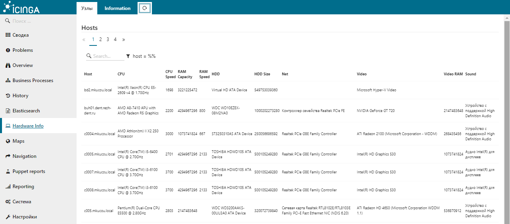

# Icinga Web 2 - Hardware information module


#### Table of Contents

1. [About](#about)
2. [License](#license)
3. [Support](#support)
4. [Requirements](#requirements)
5. [Installation](#installation)
6. [Configuration](#configuration)
7. [FAQ](#FAQ)

## About

The module is designed to display information (so far only for Windows systems) about the hardware from the MySQL database. For Linux systems, information can be collected using [OMI](https://github.com/Microsoft/omi). The module used the [jsTree](https://www.jstree.com) library.


[Description of the project, while in Russian.](http://webnote.satin-pl.com/2017/05/09/icingaweb2_module_hardwareinfo/)




## License

Icinga Web 2 and this Icinga Web 2 module are licensed under the terms of the GNU General Public License Version 2, you will find a copy of this license in the LICENSE file included in the source package.


## Requirements

  * [Icinga Web 2](https://www.icinga.com/products/icinga-web-2/) (>= 2.4.1)
  * [MySQL](https://www.mysql.com) (>=5.5)
  * [PHP](https://www.php.net)


## Installation

Create a MySQL database using the script: [sql/inventory.sql](sql/inventory.sql)

Extract this module to your Icinga Web 2 modules directory as `hardwareinfo` directory.

Git clone:

```
cd /usr/share/icingaweb2/modules
git clone https://github.com/plsatin/icingaweb2-module-hardwareinfo.git hardwareinfo
```

Enable the module in the Icinga Web 2 frontend in `Configuration -> Modules -> hardwareinfo -> enable`.
You can also enable the module by using the `icingacli` command:

```
icingacli module enable hardwareinfo
```


## Configuration

### Global Configuration

You can edit global configuration settings in Icinga Web 2 in `Configuration -> Modules -> hardwareinfo -> Configuration`.

Setting            | Description
-------------------|-------------------
Host               | **Required.** MySQL server host name.
Database           | **Required.** Database name. 
User               | **Required.** Database user name.
Password           | **Required.** Database user password.


## FAQ

### Manual collection of information

To collect information, it's enough to run the powershell script [powershell/check_hard_inventory.ps1](powershell/check_hard_inventory.ps1) on the local system.


### Collection of information with the icinga2 service

```
object CheckCommand "powershell" {
    import "plugin-check-command"
    timeout = 5m
    
    command = [ "powershell.exe" ]
    arguments = {
                        "-command" = {
                                skip_key = true
                		value = "$ps_command$"
                                order = 0
                                }
    			"-args" = {
                                skip_key = true
                		value = "$ps_args$"
                    	        order = 1
                                }
		}

}

```

```
apply Service "hardware-inventory" {
    enable_active_checks = false
    max_check_attempts = 2
    check_interval = 420h
    retry_interval = 10m
    enable_perfdata = false

    check_command = "powershell"
    vars.ps_command = "c:\\ProgramData\\icinga2\\Scripts\\icinga2\\check_hard_inventory.ps1"
    vars.ps_args = "."
    command_endpoint = host.vars.client_endpoint

    assign where host.name == host.vars.client_endpoint && host.vars.os_family == "Windows"
    ignore where host.vars.os_family == "Linux" || host.vars.os_type == "Linux"


}

```